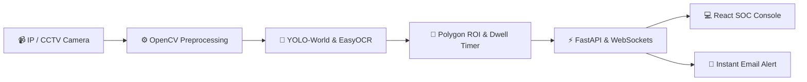

# Smart India Hackathon (SIH 2026)
## Technical Approach & Technology Stack Documentation

---

## 1. Slide-Ready Compact Architecture Flow

---

## 2. Technology-by-Technology Data Flow Diagram

### End-to-End Technology Pipeline (Step-by-Step):

```mermaid
flowchart LR
    subgraph T1["1. VIDEO INGESTION"]
        CAM["RTSP / IP Camera / DroidCam"]
    end

    subgraph T2["2. FRAME PROCESSING"]
        CV2["OpenCV (cv2)
• VideoCapture Ingestion
• Frame Scaling (1080p/720p)
• CLAHE Normalization"]
    end

    subgraph T3["3. EDGE AI INFERENCE"]
        YOLO["Ultralytics YOLO-World
• 26 Custom Classes
• Human & Vehicle Detection"]
        EASY["EasyOCR + Custom Validator
• Candidate ROI (< 4ms)
• 37 Indian State RTO Check"]
        TAMP["Laplacian Variance Engine
• Blur & Darkness Check
• Tamper / Occlusion Alert"]
    end

    subgraph T4["4. SPATIAL GEOMETRY"]
        POLY["Polygon Boundary Manager
• Ray-Casting Algorithm
• Centroid Coordinate Test"]
        DWELL["Dwell Timer Engine
• 5.0s Persistence Filter
• Breach Confirmation"]
    end

    subgraph T5["5. SERVER & ALERT ENGINE"]
        FAST["FastAPI & Uvicorn
• Async REST API Endpoints
• Non-blocking ThreadPool"]
        WS["WebSockets (60 Hz)
• Bi-directional Stream
• Live BBoxes & Telemetry"]
        SMTP["SMTP Alert Worker
• Live Annotated Snapshot
• Red Polygon & Breach Banner"]
    end

    subgraph T6["6. SOC FRONTEND CONSOLE"]
        REACT["React 18 + Vite
• Declarative Reactive UI
• Instant HMR Tooling"]
        CANVAS["HTML5 Canvas 2D
• Real-time Polygon ROI Drawing
• Live BBox & HUD Visualizer"]
        CSS["CSS3 Glassmorphism
• Responsive 4-Column Tabs:
  ALERTS | DETECT | PLATES | ALL"]
    end

    CAM -->|"Raw Video Stream"| CV2
    CV2 -->|"Preprocessed Frames"| YOLO
    CV2 -->|"Vehicle ROI Crops"| EASY
    CV2 -->|"Frame Variance"| TAMP
    
    YOLO -->|"BBoxes & Labels"| POLY
    POLY -->|"Zone Intersection"| DWELL
    
    DWELL -->|"Breach Event (>5s)"| FAST
    TAMP -->|"Tamper Event"| FAST
    EASY -->|"Verified Plate String"| FAST
    
    FAST -->|"Push Snapshot Email"| SMTP
    FAST -->|"Stream Detections & Alerts"| WS
    CV2 -->|"MJPEG Video Stream"| CANVAS
    
    WS -->|"State Synchronization"| REACT
    REACT --> CANVAS
    REACT --> CSS
```

---

## 3. Technology Stack Breakdown (Role of Each Tech in the Flow)

| Step | Technology | Data Input | Process / Transformation | Data Output |
| :---: | :--- | :--- | :--- | :--- |
| **1** | **RTSP / IP Camera / DroidCam** | Physical light & optics | Streams live H.264/MJPEG packets over local LAN or Wi-Fi | Raw network video stream |
| **2** | **OpenCV (`cv2`)** | Raw video stream | Decodes video frames at 30 FPS, resizes to optimal tensor dimensions, and applies CLAHE contrast equalization | Normalized NumPy pixel tensors (`BGR` array) |
| **3A** | **Ultralytics YOLO-World** | NumPy frame tensor | Zero-shot open-vocabulary forward pass across 26 security classes | Object bounding boxes `[x1, y1, x2, y2]`, confidence scores, and category labels |
| **3B** | **EasyOCR Engine** | Vehicle bumper crop | Fast Sobel horizontal morphology isolates candidate plates; EasyOCR extracts neural character sequences | Raw alphanumeric string |
| **3C** | **Custom Indian Plate Validator** | Raw OCR string | Validates against 37 Indian State/UT codes (`DL`, `MH`, `KA`, `UP`, `HR`, `TN`, `BH`, etc.) and filters camera watermarks | Verified license plate (e.g. `DL 8C AF 5030`) |
| **3D** | **Laplacian Variance Engine** | Grayscale frame tensor | Calculates second derivative variance to measure image sharpness and average luminance | Tamper / camera occlusion score |
| **4A** | **Polygon Boundary Manager** | Bounding box base coordinate `(cx, y2)` + user polygon points | Ray-casting point-in-polygon algorithm computes if object intersects restricted ROI | Boolean `is_inside_zone` |
| **4B** | **Dwell Time Filter** | Entity track ID + timestamp | Tracks continuous seconds spent inside the boundary; filters out transient passes (< 5.0s) | Confirmed security breach event |
| **5A** | **FastAPI & Uvicorn** | Breach events, logs, boundary requests | Asynchronous ASGI server handles REST endpoints and dispatches background tasks | JSON API responses and scheduled jobs |
| **5B** | **WebSockets** | Detection state dictionary | Broadcasts live telemetry at 60 Hz to connected clients | Real-time JSON telemetry stream |
| **5C** | **SMTP Dispatcher (Python `smtplib`)** | Incident metadata + live frame | Annotates frame with armed red polygon, intruder box, and CCTV telemetry HUD banner; sends multipart HTML email | Instant email alert with photographic proof |
| **6A** | **HTML5 Canvas 2D** | User mouse clicks + MJPEG stream | Renders user-drawn polygon vertices, crosshairs, and live bounding box overlays | Interactive visual ROI interface |
| **6B** | **React 18 & Vite** | WebSocket messages + user state | Manages reactive application state, tab navigation, and camera controls | Interactive SOC user interface |
| **6C** | **CSS3 Dark Glassmorphism** | Component DOM | Provides clean, high-contrast dark theme with responsive 4-column tabs (`ALERTS`, `DETECT`, `PLATES`, `ALL`) | Professional SOC operator console |

---

## 4. Where to Use & Real-World Deployments

* **Smart Campuses & Universities (SIH Focus)**: Automated monitoring of campus boundary walls, girls' hostel perimeters after curfew hours, and unauthorized vehicle logging.
* **Critical Infrastructure & Border Surveillance**: Power grids, railway corridors, defense perimeters, and warehouses.
* **Smart Cities & Traffic Management**: Illegal parking detection, red-light zone enforcement, and automated number plate logging.
* **Workplace Safety & Industry**: Restricted hazard perimeters around heavy machinery and camera tampering detection.
