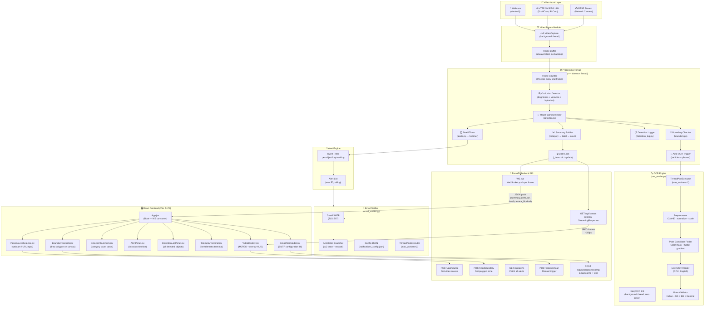
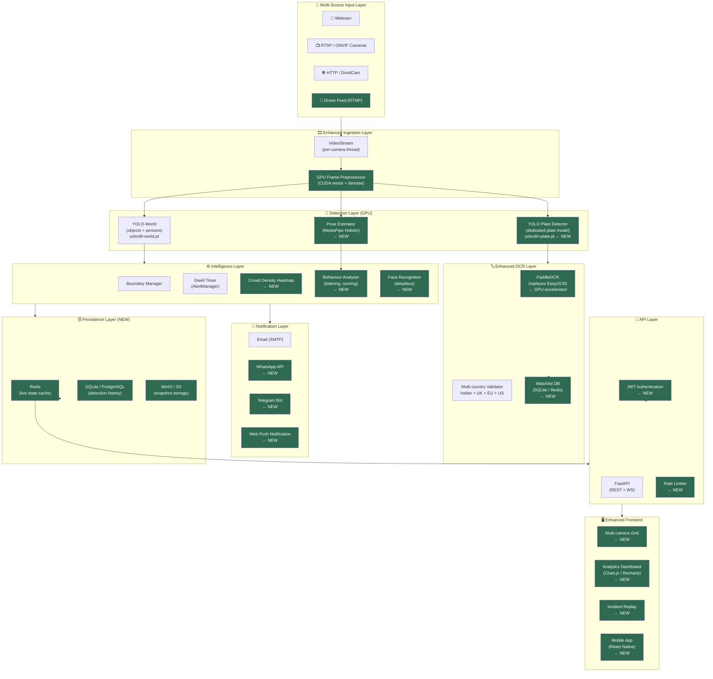

# SIH CCTV — AI Surveillance System Architecture

> **Project:** Smart India Hackathon — AI CCTV Video Analytics Platform  
> **Stack:** FastAPI + Python (Backend) · React + Vite (Frontend) · YOLO-World · EasyOCR · WebSocket · MJPEG

---

## 1. Current System Architecture

### 1.1 High-Level Overview



---

### 1.2 Detailed Data Flow (Step by Step)

```mermaid
sequenceDiagram
    participant U as 🧑 User
    participant FE as ⚛️ React Frontend
    participant API as 🔌 FastAPI
    participant VS as 📹 VideoStream
    participant PT as ⚙️ Proc Thread
    participant DET as 🤖 YOLO Detector
    participant BD as 📐 Boundary
    participant OCR as 🔤 OCR Engine
    participant ALT as 🚨 Alert Mgr
    participant EMAIL as 📧 EmailNotifier
    participant WS_C as 🔌 WebSocket

    U->>FE: Select video source (webcam/URL)
    FE->>API: POST /api/source {source: 0}
    API->>VS: stream.start(source)
    VS-->>API: is_running = True

    loop Every 20ms (processing_loop)
        VS->>PT: get_frame() → BGR ndarray
        PT->>PT: frame_counter % 2 check
        PT->>PT: Occlusion check (brightness/variance)

        alt Camera Blocked
            PT->>ALT: add_custom_alert("CAMERA OCCLUSION")
        else Clear
            PT->>DET: detect(frame)
            DET-->>PT: detections [{label, bbox, conf, category, track_id}]

            PT->>BD: is_inside_or_touching(ref_point) per detection
            BD-->>PT: intruding = {set of indices}

            PT->>OCR: submit_async(vehicle_crop) if vehicle/phone
            OCR-->>PT: (async) latest_result with plate/text

            PT->>ALT: process(detections, intruding)
            ALT-->>PT: new_alerts (if 5s dwell exceeded)

            alt New Alert Fired
                PT->>EMAIL: send_intrusion_alert_async(alert, frame, boundary)
                EMAIL-->>EMAIL: draw annotations, JPEG encode
                EMAIL-->>EMAIL: SMTP send (background thread)
            end
        end

        PT->>PT: build summary {category→{label→count}}
        PT->>WS_C: broadcast JSON per connected client
    end

    FE->>API: GET /api/stream (MJPEG)
    API-->>FE: JPEG frame stream
    FE->>FE: Draw bounding boxes + OCR HUD overlay

    U->>FE: Click "Scan Plate" button
    FE->>API: POST /api/ocr/scan
    API->>OCR: trigger_ocr_scan(latest_frame)
    OCR-->>API: {detected, plate_number, is_plate, confidence}
    API-->>FE: JSON result
    FE->>FE: Display ANPR result overlay
```

---

## 2. Component-by-Component Working Process

### 2.1 Video Ingestion — `video_stream.py`

**Purpose:** Thread-safe continuous frame grabber that always exposes only the **latest** frame, preventing processing backlog.

| Step | What Happens |
|------|-------------|
| 1 | `POST /api/source` received with source id (0 = webcam, URL string = IP cam) |
| 2 | `VideoStream.start(source)` opens `cv2.VideoCapture(source)` |
| 3 | For network streams, buffer size is set to 1 (`CAP_PROP_BUFFERSIZE=1`) to prevent stale frames |
| 4 | A daemon thread runs `_read_loop()` continuously — each iteration calls `cap.read()` |
| 5 | New frame overwrites `self._frame` under a thread lock (old frame is discarded) |
| 6 | If 30+ consecutive failures occur, the stream marks itself as `error = "connection lost"` |
| 7 | `get_frame()` returns a `.copy()` of the latest frame, thread-safe |

**Supported Sources:** Device index (webcam), `http://` (DroidCam/HTTP MJPEG), `rtsp://` (IP cameras)

---

### 2.2 Object Detection — `detector.py` (YOLO-World)

**Purpose:** Identify and classify all objects in each frame using open-vocabulary YOLO detection.

| Step | What Happens |
|------|-------------|
| 1 | `Detector.__init__()` loads `yolo11n.pt` (nano YOLO model, ~6MB) on startup |
| 2 | Class vocabulary loaded from `coco_classes.json` — maps YOLO labels to categories (HUMAN / VEHICLE / ANIMAL / OBJECT) |
| 3 | Additional custom labels added: `license plate`, `number plate` |
| 4 | Default confidence threshold: `0.25` (lowered to catch plates on phone screens) |
| 5 | `detect(frame)` runs YOLO inference on the BGR frame |
| 6 | Each detected object returns: `{label, bbox:[x1,y1,x2,y2], confidence, category, track_id, ref_point}` |
| 7 | `ref_point` is the bottom-center of the bounding box — used for boundary testing |
| 8 | `track_id` is the YOLO ByteTracker ID — persists across frames for dwell timing |

**Processing:** Every 2nd frame (PROCESS_EVERY_N=2) to balance FPS vs. detection latency.

---

### 2.3 Camera Occlusion Detection — `main.py`

**Purpose:** Detect when someone covers the camera lens or physically obstructs it.

| Step | What Happens |
|------|-------------|
| 1 | Convert frame to grayscale |
| 2 | Compute: `mean_brightness`, `std_deviation`, `laplacian_variance` |
| 3 | Occlusion is triggered if: **brightness < 28** OR **(std < 7 AND laplacian < 18)** OR **(brightness < 40 AND std < 9)** |
| 4 | Rolling counter `_occlusion_counter` increments on each blocked frame, decrements on clear |
| 5 | Alert fires only when counter reaches 2 (avoids false positives from natural darkness) |
| 6 | Alert re-fires every 10s while blocked — prevents alert spam |
| 7 | "CAMERA RESTORED" alert fires the moment occlusion clears |

**Alert Category:** `TAMPER` with emoji 🚨

---

### 2.4 Virtual Boundary System — `boundary.py`

**Purpose:** Define a custom no-go zone as a drawn polygon. Any detected object inside or touching the zone can trigger an intrusion alert.

| Step | What Happens |
|------|-------------|
| 1 | User draws a polygon in the frontend by clicking on the video frame |
| 2 | Frontend sends normalized coordinates `[[x,y], ...]` where 0.0–1.0 (relative to display size) |
| 3 | `POST /api/boundary` stores normalized points and calls `set_boundary()` |
| 4 | `BoundaryManager` scales normalized coords to actual pixel coords each frame |
| 5 | For each detected object, `is_inside_or_touching(ref_point)` is called |
| 6 | Uses `cv2.pointPolygonTest()` with signed distance — inside (positive) OR within **18px of edge** = touching |
| 7 | `TOUCH_PIXELS = 18` ensures objects grazing the boundary are caught |
| 8 | Intrusion set `{0, 2, 5...}` contains detection indices that are inside |
| 9 | `DELETE /api/boundary` clears the polygon — no zone active |

---

### 2.5 Dwell Timer & Alert Firing — `alerts.py`

**Purpose:** Only fire an alert when an object has been **continuously** inside the zone for ≥5 seconds — prevents false positives from transient crossings.

| Step | What Happens |
|------|-------------|
| 1 | Each detected object gets a slot key: `f"{label}_{track_id}"` |
| 2 | First frame inside zone: `entry_time = now`, `alerted = False` |
| 3 | Subsequent frames inside: `dwell = now - entry_time` |
| 4 | If `dwell >= 5.0s` AND not yet alerted: **fire alert** |
| 5 | Alert contains: label, track_id, dwell seconds, timestamp, bounding box |
| 6 | `alerted = True` after first fire — **no repeat alerts for same continuous presence** |
| 7 | Object leaves zone → slot resets to `{entry_time: None, alerted: False}` |
| 8 | If re-enters: 5-second clock starts fresh from zero |
| 9 | Max 50 alerts stored in rolling memory |

**Dwell times** are also sent to the frontend via WebSocket to show a countdown progress bar in the UI.

---

### 2.6 OCR & ANPR Engine — `ocr_reader.py`

**Purpose:** Extract text and recognize license plates from detected vehicle/object crops. Multi-format validator supporting Indian, UK, and international plates.

#### Initialization
| Step | What Happens |
|------|-------------|
| 1 | Server starts — `OCRReader.__init__()` launches a daemon thread |
| 2 | Background thread loads `easyocr.Reader(['en'], gpu=False)` — takes ~5s |
| 3 | Main server is fully responsive during this time (zero startup delay) |
| 4 | `is_ready = True` after EasyOCR loads |

#### Automatic Scan (Per Frame — Non-blocking)
| Step | What Happens |
|------|-------------|
| 1 | Processing loop checks each detection: is it a vehicle, license plate label, or phone? |
| 2 | If yes AND crop is at least 40×20px → `submit_async(crop)` called |
| 3 | Cooldown check: skip if last scan was < 1.5s ago (prevents redundant scans) |
| 4 | `ThreadPoolExecutor` (max_workers=1) runs `read()` in background |
| 5 | Main processing loop is **not blocked** — continues at 30 FPS |

#### Plate Candidate Finding
| Step | What Happens |
|------|-------------|
| 1 | **Color Method:** Convert crop to HSV, create yellow mask (H:10–40, S:40–255, V:70–255) + white mask (H:any, S:0–50, V:150–255) |
| 2 | Morphological close with 15×3 kernel to connect nearby plate characters |
| 3 | Find contours → filter by aspect ratio 1.3–7.0 (plate shape) and area > 80px |
| 4 | **Gradient Method:** Sobel X-gradient → Gaussian blur → Otsu threshold → morph close |
| 5 | Both methods find candidate bounding boxes, deduplicated by IoU > 0.4 |
| 6 | Top 6 candidates returned sorted by area (largest first) |

#### OCR Read Cascade (3-tier fallback)
| Step | What Happens |
|------|-------------|
| **Tier 1** | For each candidate plate ROI: upscale to min 70px height, preprocess, run EasyOCR on sub-crop |
| **Tier 2** | Run EasyOCR on full preprocessed crop (whole vehicle/object) |
| **Tier 3** | Manual scan via `POST /api/ocr/scan` with 3-region fallback (vehicle bbox → center → full frame) |

#### Image Preprocessing
| Step | What Happens |
|------|-------------|
| 1 | For vehicles: crop bottom 65% (plates are on bumpers, not roof) |
| 2 | Scale large images down to 640px width (speed) |
| 3 | Scale tiny images up to 280px width (accuracy) using `INTER_CUBIC` |
| 4 | Convert to grayscale + min-max normalize (stretches ink to pure black, background to white) |
| 5 | Convert back to BGR for EasyOCR compatibility |

#### Plate Validation (Multi-country)
| Format | Pattern | Example |
|--------|---------|---------|
| **Indian RTO** | `AA NN [AAA] NNNN` | `MH 12 AB 1234` |
| **Indian BH Series** | `NN BH NNNN AA` | `22 BH 1234 AA` |
| **UK Standard** | `AANN AAA` | `AB12 CDE` |
| **UK Prefix** | `A NNN AAA` | `R88 SPU` |
| **General** | 4–9 mixed alpha+numeric | `ABC 1234` |

Character correction applied: `O↔0`, `I↔1`, `B↔8`, `S↔5`, `Z↔2`, `G↔6`

Filter list blocks camera watermarks: `DROIDCAM`, `VIDEO`, `CAMERA`, `WEBCAM`, `FULLSCREEN`, etc.

---

### 2.7 Email Alert Notification — `email_notifier.py`

**Purpose:** Send automated email alerts with annotated snapshots when an intrusion alert fires.

| Step | What Happens |
|------|-------------|
| 1 | User configures SMTP in the Email Modal (Gmail + app password) |
| 2 | Config saved to `notifications_config.json` with `POST /api/notifications/config` |
| 3 | When alert fires in `processing_loop`, `send_intrusion_alert_async()` is called |
| 4 | `ThreadPoolExecutor` (max_workers=2) handles dispatch — does NOT block video |
| 5 | Snapshot is annotated: bounding boxes drawn, boundary polygon drawn, timestamp overlaid |
| 6 | JPEG-encoded image attached to email as inline attachment |
| 7 | HTML email composed with alert details: object label, dwell time, timestamp, confidence |
| 8 | Sent via `smtplib` → Gmail SMTP (TLS port 587) |
| 9 | Cooldown of 45 seconds prevents email flooding |
| 10 | Status (SENT / ERROR / IDLE) broadcast to frontend via WebSocket |

---

### 2.8 MJPEG Stream & WebSocket — `main.py`

#### MJPEG Stream — `GET /api/stream`
| Step | What Happens |
|------|-------------|
| 1 | Browser `` opens persistent HTTP connection |
| 2 | `mjpeg_generator()` runs as async generator |
| 3 | Each iteration grabs `_latest["detections"]` and overlays bounding boxes on frame |
| 4 | Boundary polygon drawn with semi-transparent fill (red on alert, blue when safe) |
| 5 | Frame JPEG-encoded at quality 85 |
| 6 | `multipart/x-mixed-replace` boundary format pushes frames continuously |
| 7 | Frame rate: ~30 FPS (limited by `time.sleep(0.02)` in processing loop) |

#### WebSocket — `WS /ws`
| Step | What Happens |
|------|-------------|
| 1 | Frontend connects `new WebSocket("ws://localhost:8000/ws")` on mount |
| 2 | Server accepts and adds to `_ws_clients` set |
| 3 | Every frame cycle, `broadcast_ws()` serializes `_latest` state to JSON |
| 4 | Payload: `{summary, alerts, detection_log, dwell_times, ocr, camera_blocked, active_intrusion, email_status}` |
| 5 | Stale OCR (>4.5s old) is cleared before broadcast so HUD auto-dismisses |
| 6 | On client disconnect, removed from set cleanly |
| 7 | Frontend auto-reconnects after 2s if disconnected while stream is active |

---

### 2.9 Frontend UI Components

| Component | Role |
|-----------|------|
| **App.jsx** | Root component. Manages WebSocket connection, distributes state to all children |
| **VideoDisplay.jsx** | Renders MJPEG feed. Shows bounding box overlays (SVG). Shows OCR/ANPR HUD. "Scan Plate" button triggers `POST /api/ocr/scan` |
| **VideoSourceSelector.jsx** | Input for webcam index or IP/URL. Calls `POST /api/source` and `DELETE /api/source` |
| **BoundaryControls.jsx** | Canvas overlay for drawing polygon points. Sends normalized coords to `POST /api/boundary` |
| **DetectionSummary.jsx** | Live count cards — HUMAN / VEHICLE / ANIMAL / OBJECT with animated counters |
| **AlertPanel.jsx** | Timeline of intrusion alerts with timestamps, labels, dwell durations |
| **DetectionLogPanel.jsx** | Full log of every unique detected object including plate numbers |
| **TelemetryTerminal.jsx** | Terminal-style live data readout — detection categories, OCR results, system status |
| **EmailAlertModal.jsx** | SMTP configuration form. Test email button. Real-time delivery status display |

---

## 3. Future Architecture (Proposed Upgrades)



> **Legend:** 🟩 Green boxes = New features not yet implemented

---

## 4. Current System File Map

```
SIHCCTV/
├── backend/
│   ├── main.py               ← FastAPI app, processing loop, all endpoints
│   ├── video_stream.py       ← Threaded frame grabber (webcam/RTSP/HTTP)
│   ├── detector.py           ← YOLO-World inference wrapper
│   ├── boundary.py           ← Virtual zone polygon + point-in-polygon
│   ├── alerts.py             ← 5-second dwell timer + alert list
│   ├── ocr_reader.py         ← EasyOCR + plate candidate finder + validator
│   ├── detection_log.py      ← Persistent per-session detection history
│   ├── email_notifier.py     ← Async SMTP email with annotated snapshots
│   ├── coco_classes.json     ← YOLO label → category mapping
│   └── notifications_config.json  ← Saved email SMTP config
│
└── frontend/
    └── src/
        ├── App.jsx                    ← Root, WS state manager
        ├── config.js                  ← API_URL, WS_URL constants
        └── components/
            ├── VideoDisplay.jsx        ← MJPEG feed + bounding box HUD + OCR overlay
            ├── VideoSourceSelector.jsx ← Source input (webcam/URL)
            ├── BoundaryControls.jsx    ← Polygon draw tool
            ├── DetectionSummary.jsx    ← Live object counts
            ├── AlertPanel.jsx          ← Intrusion alert timeline
            ├── DetectionLogPanel.jsx   ← All detected objects log
            ├── TelemetryTerminal.jsx   ← Terminal-style live telemetry
            └── EmailAlertModal.jsx     ← SMTP config + test email UI
```

---

## 5. Key Design Decisions & Engineering Trade-offs

| Decision | Reason |
|----------|--------|
| **Process every 2nd frame** | Doubles effective FPS for the video stream without halving detection quality — plates don't move frame-to-frame |
| **OCR in ThreadPoolExecutor (max=1)** | Prevents OCR from spawning parallel threads that compete for CPU and degrade video framerate |
| **EasyOCR initialized in background thread** | Zero cold-start delay on server boot — API is ready to serve before OCR is loaded |
| **Normalized boundary coordinates** | Frontend screen size != backend frame size. Normalizing decouples them completely |
| **5-second dwell timer** | Eliminates false alerts from people momentarily walking through a zone |
| **Rolling `_latest` dict with state lock** | Single shared state object — no queues, no message passing, minimal overhead |
| **MJPEG for video, WebSocket for data** | MJPEG is universally supported in `` tags. WS provides low-latency bidirectional data |
| **OCR cooldown 1.5s** | Prevents scanning the same vehicle 30 times per second, which would starve the thread pool |
| **18px touch threshold for boundary** | Prevents "edge slipping" where a person's foot briefly leaves the zone between frames |

---

*Document generated: 2026-09-10 — SIH CCTV AI Surveillance Platform*
